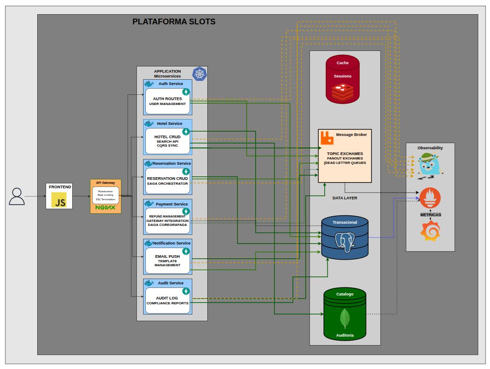
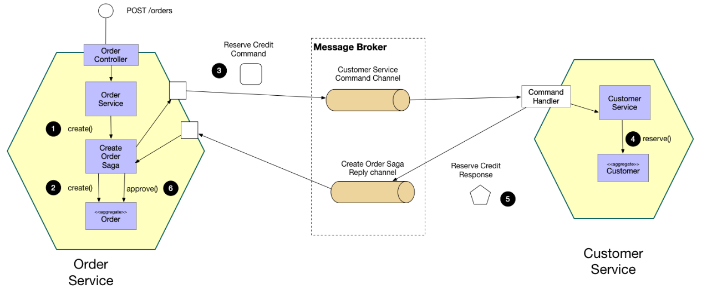

# Estágio II em Desenvolvimento Web — Turma B · Equipe Alfa

Repositório oficial da equipe **Alfa** (Turma B) na disciplina de **Estágio II em
Desenvolvimento Web** — 2026.2.

[Acessar pasta de documentação do ronildo](./docs/ronildo/readme.md)

⚠️OBS: Nessa arquitetura nao estamos mais utilizando o poetry e sim o pip via requirements.txt, por ser mais pratico, dar menos dor de cabeça e mantem a saude mental para ver se duramos ate o lançamento do GTA6 🤠

  <strong>Sistema de Rede Hoteleira Distribuida</strong>

  Sistema baseado em Arquitetura de microsservices com foco em escalabilidade e performace para uma franquia de hotéis que atua em múltiplas cidades.

 

  
  
  
  
  
  
  
  
  
  

> **Documentação viva:** esta documentação encontra-se em evolução contínua e pode sofrer alterações conforme novos serviços, componentes, arquiteturas e capacidades são implementados.

---

## 📖 Visão Geral

A Plataforma é um sistema integrado de reservas para redes hoteleiras, desenvolvido com arquitetura de microserviços event-driven em Python/FastAPI. A plataforma resolve os principais gargalos operacionais de franquias que atuam em múltiplas cidades, eliminando overbooking, centralizando dados e proporcionando uma experiência de reserva escalável e segura com baixo consumo de memoria.

No momento inicial da plataforma serao desenvolvidos 6 serviços, onde ficaram responsaveis desde a autenticaçao ate sua auditoria.

## 🏗️ Principios de Arquitetura
| Princípio                                       | Descrição                                                                                                          | Implementação na Plataforma                                                                                         |
| ----------------------------------------------- | ------------------------------------------------------------------------------------------------------------------ | ------------------------------------------------------------------------------------------------------------------- |
| Domain-Driven Design (DDD)                      | Decomposição de serviços orientada a domínios de negócio (Auth, Hotel, Reservation, Payment, Notification, Audit). | 6 microserviços independentes, cada um com seu próprio banco de dados e responsabilidades claras.                   |
| Independent Deployment                          | Cada serviço pode ser implantado, escalado e atualizado independentemente.                                         | Docker Compose para desenvolvimento local; Kubernetes para produção com deployments isolados por serviço.           |
| Event-Driven Communication                      | Comunicação assíncrona baseada em eventos via RabbitMQ (Topic + Fanout exchanges).                                 | Todos os serviços publicam e consomem eventos (ex: RESERVA_SOLICITADA, PAGAMENTO_APROVADO).                         |
| Transactional Outbox Pattern                    | Garantia de atomicidade entre escrita no banco e publicação de eventos.                                            | Tabela outbox_messages em cada serviço + worker relay para RabbitMQ.                                                |
| Saga Orchestration                              | Coordenação de transações distribuídas com compensação em caso de falha.                                           | reservation-service como orchestrator da Saga de reserva (criação → pagamento → confirmação/cancelamento).          |
| CQRS (Command Query Responsibility Segregation) | Separação entre modelos de escrita (PostgreSQL) e leitura (MongoDB + Redis).                                       | hotel-service: Write Model em PostgreSQL, Read Model (catálogo) em MongoDB com cache Redis.                         |
| Resilience & Fault Isolation                    | Isolamento de falhas com padrões de resiliência (Retry, Dead Letter Queue, Circuit Breaker).                       | RabbitMQ com DLQ, retry com exponential backoff (3 tentativas), prefetch=1 para ordenação.                          |
| Secure Service-to-Service                       | Comunicação segura entre serviços com autenticação JWT e RBAC.                                                     | JWT stateless com chaves RSA, validação de token no API Gateway e middleware de auth em cada serviço.               |
| Automated CI/CD                                 | Pipelines de integração e entrega contínua com scanning de segurança de containers.                                | GitHub Actions: build, test, Trivy/Snyk scan, SBOM, push para ECR, deploy progressivo (dev → staging → production). |
| Containerized Deployment                        | Implantação em containers Docker com orquestração via Docker Compose (dev) e Kubernetes (prod).                    | Cada serviço tem seu próprio Dockerfile multi-stage; imagens escaneadas antes do deploy.                            |
| Polyglot Persistence                            | Uso de múltiplos bancos de dados especializados por domínio.                                                       | PostgreSQL (transacional), MongoDB (catálogo + auditoria), Redis (cache).                                           |
| API Gateway Pattern                             | Gateway centralizado para roteamento, rate limiting, SSL termination e autenticação.                               | Nginx como API Gateway com plugins de auth, rate limiting e logging.|

### Camadas da Arquitetura

A plataforma segue uma arquitetura separando responsabilidades para garantir escalabilidade, manutenabilidade e testabilidade.

---

## 📦 Microserviços

A plataforma é organizada onde cada serviços trabalha em suas respectivas portas, pensando em padrao de arquitetura e documentaçao das APIs.

| Docs do Serviço | Responsabilidade | Banco | Porta API |
| :--- | :--- | :--- | :--- |
| [`auth-service`](./apps/services/auth-service/README.md) | Autenticação, autorização, gestão de usuários e roles | PostgreSQL | `8081` |
| [`hotel-service`](./apps/services/hotel-service/README.md) | Catálogo de hotéis, quartos, cidades, comodidades | PostgreSQL | `8082` |
| [`reservation-service`](./reservation-service) | Gestão de reservas, disponibilidade, precificação, sagas | PostgreSQL | `8083` |
| [`payment-service`](./payment-service) | Processamento de pagamentos, reembolsos, gateways | PostgreSQL | `8084` |
| [`notification-service`](./notification-service) | E-mails, SMS, push notifications, templates | PostgreSQL | `8085` |
| [`audit-service`](./audit-service) | Trilha de auditoria imutável, logs de segurança, compliance | MongoDB | `8086` |

## Front e Mensageria

| Outros Serviços | Endereços |
| :--- | :--- |
| Frontend | http://localhost:5173 |
| Painel do RabbitMQ | http://localhost:15672 |

---

# 🧭 Arquitetura, Fluxos e Diagramas da Plataforma

Esta seção apresenta os principais fluxos, componentes e decisões arquiteturais implementados na plataforma até o momento.
As imagens abaixo representam diferentes estágios de desenvolvimento e teste e destinam-se a fornecer evidência visual da plataforma operando com sucesso.

Os diagramas têm como objetivo facilitar a compreensão das interações entre serviços, infraestrutura e componentes da plataforma, servindo também como referência durante o desenvolvimento e evolução da arquitetura.

> A documentação é viva e pode ser atualizada continuamente a qualquer momento conforme novos serviços, integrações e componentes são implementados.

> Os screenshots são intencionalmente apresentados como evidência de implementação em vez de estarem atrelados a uma categoria específica de documentação. No entanto, 
cada serviço tem suas imagens e explicaçao em suas devidas configurações.

> Nota: Os padrões apresentados nesta seção representam apenas os principais conceitos arquiteturais utilizados na plataforma. A documentação completa de cada domínio pode conter outros padrões e estratégias específicas. Para conhecer as demais implementações, consulte os links disponíveis nas respectivas seções e documentações dos seus respectivos serviços.

---

# Padroes de Arquitetura de Software

#### Principal Logica da Arquitetura SAGA ORQUESTRADA

No sistemas contamos com SAGA Orchestrator, onde ele atua como coordenador central da Saga. Ele não executa diretamente as regras de negócio dos serviços participantes, sua responsabilidade é controlar a sequência de execução, acompanhar os resultados e determinar a próxima etapa do processo.

Essa abordagem permite que cada serviço permaneça responsável pelo seu próprio domínio, enquanto o Orchestrator mantém o controle do fluxo distribuído.

#### Diagrama do Tratamento dos Dados para Reserva Aprovada

#### Diagrama do Tratamento dos Dados para Reserva Recusada

PAREI AQUI, LOGO MAIS CONTINUAMOS

# Mensageria e Comunicação

---

# Deploy e Conteiners

---

# Modelagem de Bnaco de Dados

---

# Infraestrutura 

