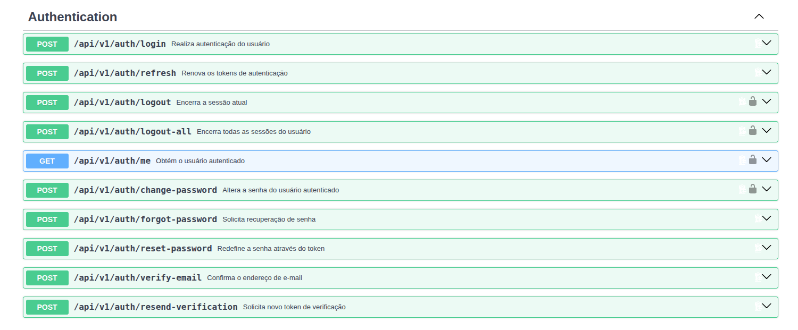
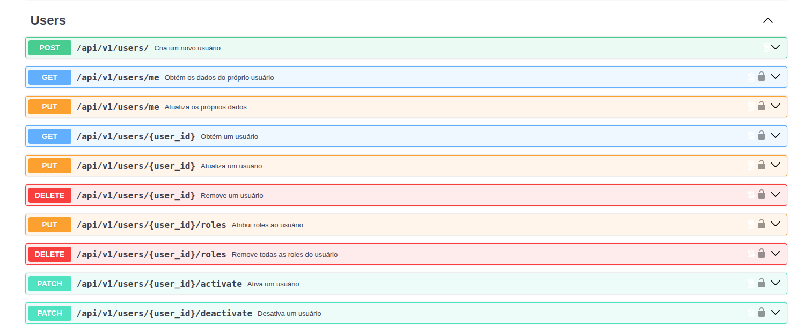
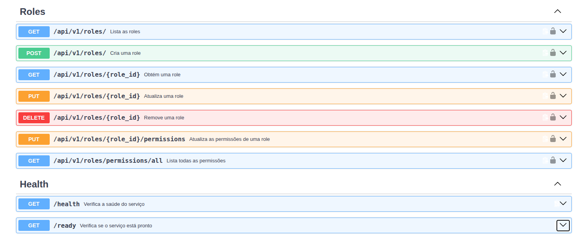

=======
# Auth Service

Serviço responsável pela autenticação, identidade e autorização da plataforma de reservas hoteleiras.

## Responsabilidades

- Cadastro de usuários
- Autenticação de usuários
- Hash seguro de senhas
- Geração de Access Token JWT
- Geração de Refresh Token JWT
- Validação de tokens
- Controle de usuários ativos
- Controle de roles
- Controle de permissões
- Autorização de recursos protegidos

## Tecnologias

- Python 3.12
- FastAPI
- SQLAlchemy
- PostgreSQL
- Alembic
- JWT
- Argon2
- Poetry
- Pytest
- Docker

## Execução local


Entre no diretório do serviço:

```bash
cd apps/services/auth-service

Suba os containers:

docker compose up --build

Para executar em segundo plano:

docker compose up --build -d

Verificar os containers:

docker compose ps

Visualizar logs:

docker compose logs -f auth-service

Parar os serviços:

docker compose down

API

Após a inicialização, a documentação da API pode ser acessada em:

http://localhost:8000/docs