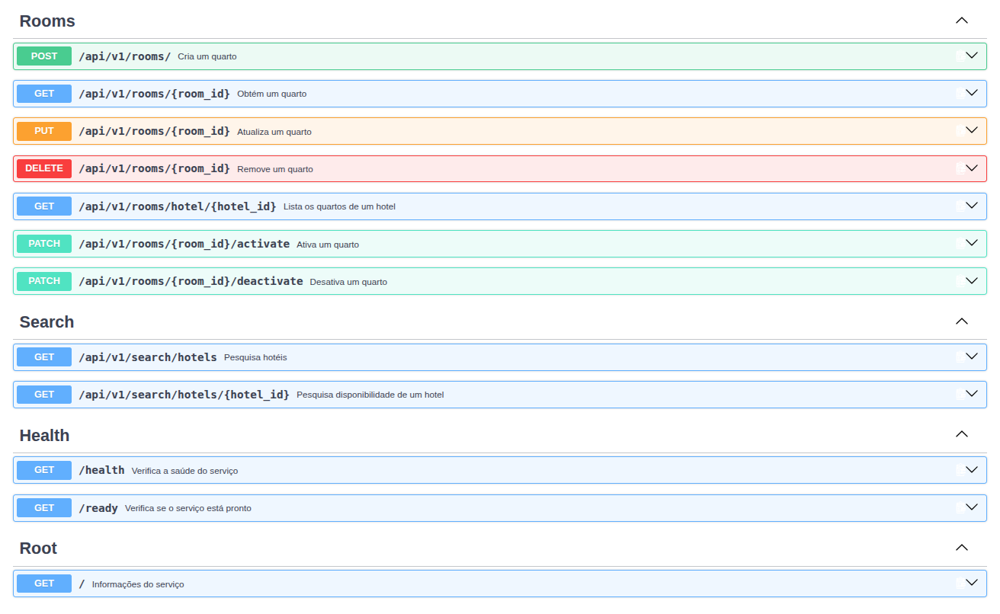

## Execução local


Entre no diretório do serviço:

```bash
cd apps/services/auth-service

Suba os containers:

docker compose up --build

Para executar em segundo plano:

docker compose up --build -d

Verificar os containers:

docker compose ps

Visualizar logs:

docker compose logs -f auth-service

Parar os serviços:

docker compose down

API

Após a inicialização, a documentação da API pode ser acessada em:

http://localhost:8000/docs